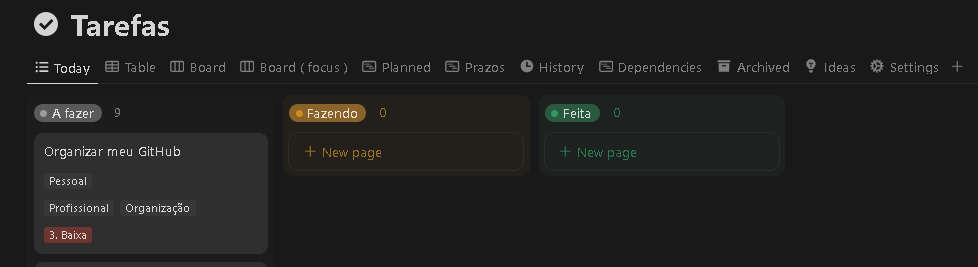

# Elicitação de Requisitos

Para essa fase do projeto, optamos por utilizar 2 métodos diferentes: entrevistas, para falar diretamente com os usuários sobre o que eles gostariam do sistema e, e benchmarking, para entender como empresas similares solucionam o problema.
# Entrevistas

Foram feitas 3 entrevistas de forma online. Tentamos utilizar o modelo de pirâmide, indo de perguntas objetivas para subjetivas, uma vez que foi dito que esse modelo seria melhor para pessoas tímidas.

## 1. Introdução

### 1.1. Propósito

O objetivo deste documento é descrever de forma clara e organizada os requisitos do sistema, com base na análise das entrevistas com usuários potenciais. O sistema a ser desenvolvido visa melhorar a gestão de estudos, oferecendo suporte para organização de cronogramas, práticas de exercícios e bloqueio de distrações.

### 1.2. Escopo

O software será uma aplicação web e móvel voltada para estudantes universitários e de cursinhos pré-vestibular. Ele permitirá que os usuários organizem seus cronogramas de estudo, pratiquem exercícios de maneira eficaz e se concentrem, evitando distrações.

### 1.3. Definições, acrônimos e abreviações

SRS: Software Requirements Specification (Especificação de Requisitos de Software)  
IEE 830-1998: Norma da IEEE para Especificação de Requisitos de Software  
CR: Coeficiente de Rendimento  
Pomodoro: Técnica de gerenciamento de tempo que divide o trabalho em intervalos, geralmente de 25 minutos.

### 1.4. Referências

Entrevistas realizadas com estudantes de diferentes cursos, documentadas no arquivo de transcrição. Baseado nos conceitos descritos pela IEEE 830-1998 para especificação de requisitos.

## 2. Descrição Geral

### 2.1. Perspectiva do Produto

O produto será uma aplicação, acessível em computadores, permitindo que os usuários gerenciem seus cronogramas de estudo, realizem exercícios e se concentrem durante as sessões de estudo. Ele poderá ser integrado com sistemas de organização, como calendários, e ferramentas de prática, como bancos de questões.

### 2.2. Funções do Produto

O sistema permitirá aos usuários:  
- Organização de cronogramas: Planejamento detalhado de sessões de estudo.  
- Monitoramento de progresso: Indicadores visuais que mostram o avanço nas matérias estudadas. -> Benchmarking tem plataformas assim  
- Exercícios práticos: Banco de questões e feedback automatizado para ajudar na preparação. -> Como RespondeAí/plataformas de cursinho online.  
- Foco e concentração: Bloqueio de distrações, sons ambiente e integração com técnicas de estudo (ex.: Pomodoro). -> Study Together faz isso.

### 2.3. Características dos Usuários

Os usuários do sistema são estudantes universitários e de cursinho pré-vestibular. A faixa etária varia entre 18 e 25 anos, com diferentes perfis de estudo:  
- Estudante que segue métodos rígidos, mas sofre com pressão em períodos de prova.  
- Estudante que precisa de suporte para melhorar sua organização e foco.  
- Usuários que preferem métodos baseados em exercícios práticos.

### 2.4. Restrições Gerais

O sistema deve funcionar tanto em dispositivos móveis quanto em computadores.  
Deve ser capaz de operar offline para garantir o acesso em locais sem conexão à internet.

### 2.5. Suposições e Dependências

Os usuários terão acesso a dispositivos com conexão à internet para sincronizar seus cronogramas e resultados.

## 3. Requisitos Específicos

### 3.1. Requisitos Funcionais

#### 3.1.1. Organização de Cronogramas

Dependendo da complexidade, o sistema só permite a funcionalidade de forma visual e não realiza um pré-processamento do cronograma.

Plataforma de cursinho como Stood faz isso.

Descrição: O sistema permitirá que os usuários criem cronogramas semanais ou mensais de estudo.  
Entrada: O usuário define a quantidade de matérias, tempo disponível e metas de estudo.  
Processamento: O sistema gera um plano de estudo com base nas informações fornecidas.  
Saída: Exibição do cronograma e lembretes automáticos.  
Prioridade: Alta

#### 3.1.2. Monitoramento do Progresso

Descrição: O sistema acompanha o progresso de cada matéria e exibe gráficos e listas de tarefas concluídas.  
Entrada: O usuário marca atividades como concluídas.  
Processamento: O sistema atualiza o progresso e gera relatórios de desempenho.  
Saída: Relatórios gráficos do progresso semanal.  
Prioridade: Média

#### 3.1.3. Exercícios Práticos

Descrição: O sistema oferece um banco de questões relacionadas às matérias estudadas, com feedback automático.  
Entrada: O usuário seleciona o tema ou matéria para praticar.  
Processamento: O sistema apresenta questões e analisa as respostas.  
Saída: Feedback imediato sobre o desempenho do usuário.  
Prioridade: Alta

#### 3.1.4. Bloqueio de Distrações

-> Aplicativos de pomodoro utilizam isso.

Descrição: O sistema permite ao usuário ativar um modo de concentração, bloqueando notificações e interrompendo aplicativos que possam distrair Entrada: O usuário ativa o modo de concentração.  
Processamento: O sistema bloqueia notificações e sugere sons ambiente.  
Saída: Relatório de tempo em modo de concentração.  
Prioridade: Alta

### 3.2. Requisitos Não Funcionais

#### 3.2.1. Usabilidade

Necessário reescrever no formato como do slide

Descrição: A interface com o usuário do sistema deve ser projetada para fácil utilização, apropriada para um público com básico conhecimento em informática ou que usaram aplicativos semelhantes, sem treinamento adicional no sistema  
Prioridade: Alta

#### 3.2.2. Desempenho

Descrição: O sistema deve ser responsivo e capaz de lidar com múltiplas entradas de usuários em tempo real.  
Prioridade: Média

#### 3.2.3. Confiabilidade

Descrição: O sistema deve garantir que os dados do usuário, como cronogramas e progresso, sejam armazenados com segurança e sem perda de informações.  
Prioridade: Alta

## 4. Validação dos Requisitos

Para garantir que os requisitos descritos estejam de acordo com as necessidades dos usuários, as seguintes atividades de validação serão realizadas:  
- Revisões de protótipos com base nos requisitos elicitados nas entrevistas.  
- Testes com grupos de estudantes para garantir a usabilidade e eficácia das funcionalidades.  
- Coleta de feedback contínuo durante o desenvolvimento.

## 5. Apêndices

- [Roteiro das entrevistas](./assets/roteiro-das-entrevistas.md)
- [Transcrição das entrevistas](./assets/transcricao-das-entrevistas.md)

# Benchmarking

## 1. Ferramentas analisadas

### 1.1. Notion

O Notion tem o objetivo de ser uma aplicação geral, capaz de servir múltiplos propósitos. Dentro da comunidade de produtividade e estudos, é uma das queridinhas do mercado.
Aspectos relevantes:
- Pessoas podem criar páginas e sistemas de páginas a serem compartilhadas com outros usuários no formato de templates.
    
- Construção da página em blocos permite alto poder de personalização.
    
- Capacidade de exportar o conteúdo em formatos populares no mercado: LaTex, Markdown, etc.
- Adição de fórmulas matemáticas através da sintaxe KaTex, permitindo que se escreva fórmulas complexas, incluindo símbolos de integral, de somatório, frações e afins.
- Capacidade de fazer referência a blocos da plataforma com facilidade, o que permite criar links entre eles.
	
- Pré-visualização em pop-up das referências a outros blocos pelo hover do cursor, permitindo que o usuário visualize parte do conteúdo sem precisar sair da página em que está.
	
- Anexo de documentos de toda sorte, incluindo a visualização de seus conteúdos sem a necessidade de sair da plataforma.
- Ampla capacidade de integração com outras aplicações, como a suíte de programas do Google, o Github e tantas mais; por exemplo: docs do Google podem ser visualizados dentro do Notion, vídeos do Youtube também.
- Base de dados permite visualizar tarefas de diferentes formas: calendário, lista, tabela etc.
    
	
	
	

  
### 1.2. Khan Academy

Talvez mais conhecida fora do Brasil, a Khan Academy é uma plataforma que oferta cursos gratuitos, com grande foco em exatas, cobrindo todos os níveis de ensino.

Aspectos relevantes:
- Divisão das áreas de estudo em tópicos, subtópicos e unidades. 
    
	
- Visualização do progresso dentro da unidade e o status de seus exercícios.
    
- Sistema de pontuação conforme se avança na tarefa: completar exercícios gera pontos, assistir vídeos e ler artigos também.
    
- Perfil de usuário que permite mostrar suas conquistas dentro da plataforma para outros usuários.
    
- Sistema de streak semanal: se o usuário atinge objetivos na semana, ele ganha um streak. Os streaks vão se acumulando em semanas consecutivas de objetivos atingidos. Não atingir uma semana quebra a sequência.
    
- Sistema de nível: conforme o usuário conclui atividades, avança de nível na plataforma.
    
- Área de comentários abaixo das lições para discussão entre os usuários.

### 1.3. Study Together

Sistema que evoluiu de um servidor no Discord durante a pandemia, a fim de criar uma comunidade de estudos, para uma plataforma de estudos.

Aspectos relevantes:
- Dispõe das funcionalidades do Discord: canais de voz e texto, diversos bots de música e o prṕrio bot do study together, que sincroniza as informações com o site.
- Dispõe de um timer para auxiliar o estudo usando a técnica pomodoro: períodos de foco e períodos de pausa.
- Apresenta estatísticas de estudo, que incluem gráficos de barra, como: tempo diário estudado, podendo fazer um recorte semanal/mensal; média diária de estudos e afins.
- Status de usuários que batem uma determinada meta de estudo: horas totais estudadas, horas totais naquele mês e dias de streak
	
	
- Ranks globais e entre amigos atualizados de acordo com as horas estudadas no mês – a contagem para o rank se reinicia todo início de mês.
    
- Possui lobbies de interação entre usuários via texto, que serve tanto como chat de bate-papo, quanto chats especializados por temas, como: matemática, química, física etc.
    
- Personalização do ambiente de estudos através de backgrounds, com som ambiente dependendo da paisagem que o usuário escolher e que pode ser substituído por um vídeo do Youtube
    

  
### 1.4. Responde aí

Plataforma de estudos voltada para tópicos de exatas do ensino superior.

Aspectos interessantes:
- Disponibilização da resolução de exercícios, provas e livros. Exercícios dos livros são separados por capítulo, o que facilita encontrá-los.
- Divisão em tópicos, subtópicos e unidades.
- Divisão dos tópicos com base na universidade que você estuda, permitindo acompanhá-los no Responde aí seguindo na mesma sequência que a universidade oferece.
    - Essa feature permite que os tópicos sejam usados como uma checklist, e o estudante pode acompanhar seu progresso na matéria através do Responde Aí.
    - Esse aspecto não está presente no Khan Academy, o que dificulta muito acompanhar cursos pelo Khan.
        
        
- Capacidade de montar guias para provas, selecionando os assuntos que podem cair na prova. A plataforma automaticamente identifica a ordem que os itens precisam estar para serem seguidos pelo estudante.
- No plano de estudos são linkadas outras alternativas de estudo que são referentes aos tópicos selecionados: aulões e livros respondidos.
	
	
- Você posta provas e ganha 3 meses de graça, incentivando a atividade.

### 1.5. Duolingo

Aplicativo para aprendizado de línguas, já bastante consolidado no mercado.

Aspectos interessantes:
- Atividades divididas em tópicos, subtópicos e unidades.
	
- Agrupamento de exercícios para revisão: quando você erra um exercício, ele é marcado para que você possa revê-lo; sugestão de palavras para estudar de acordo com quanto tempo você não as vê.
- Sistema de streaks diário para incentivar uso frequente do aplicativo
- Fórum de dúvidas para estudantes interagirem sobre os exercícios.
- Sistema de ranking entre os usuários, incluindo diferentes ligas e rebaixamento/promoção entre elas.

## 2. Observações

As aplicações partilham alguns aspectos em comum, como:
- A divisão das atividades em tópicos, subtópicos e unidades.
- O uso de streaks para incentivar uso frequente da aplicação.
- Gamificação das plataformas: pontos de experiência, níveis, conquistas.
- Área destinada à interação entre os usuários.

Além desses pontos em comum, destacam-se:
- a visualização de anexos sem sair da plataforma do Notion, pois permite que o usuário não precise deixar a plataforma sempre que quiser acessá-los;
- a seleção automática da ordem do plano de estudos do Responde Aí, que dá menos trabalho para o usuário;
- e as estatísticas de estudo do Study Together, que permitem ao usuário analisar o seu progresso.
